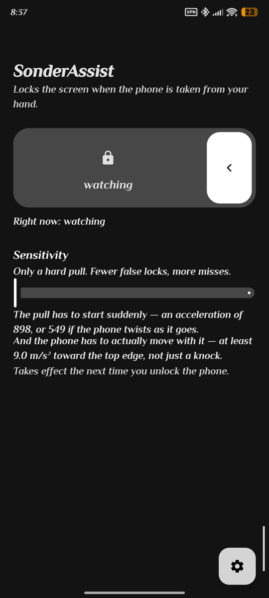
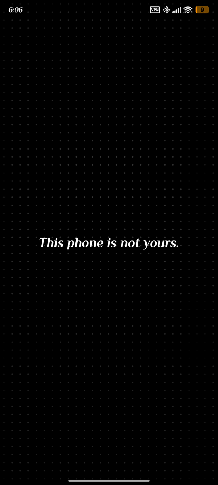

# SonderAssist

**Locks the screen the moment your phone is pulled out of your hand — and then tells someone where it went.**

[](https://github.com/Verisonder/SonderAssist/releases/latest)
[](LICENSE)


<p align="center">
  
  
</p>

<p align="center">
  <sub>The switch, and what a thief sees.</sub>
</p>

---

## Why this exists

Android already has **Theft Detection Lock**, and it is good. It watches the motion sensors
for a phone being snatched and locks the screen. But it waits for the getaway — the snatch
*followed by* running, biking or driving.

That leaves a gap, and it is the ordinary case. Someone takes your phone and walks off.
Someone takes it as the train doors close. Neither produces a getaway the model recognises,
so the screen stays unlocked with everything on it.

SonderAssist fires on the grab itself.

**It is not a replacement for Theft Detection Lock.** Leave that on. This covers a case it
does not.

---

## What it does

**Locks instantly.** A sharp pull toward the top of the phone, in the phone's own frame,
with the phone actually moving — then a confirmation window that rejects a drop and rejects
being put down. Device Admin `force-lock`, so the screen comes back needing your PIN.

**Makes a noise.** On the alarm channel at full volume, so it is heard through silent mode.
It waits a few seconds first, which is what lets you cancel a false alarm before it wakes a
room.

**Says something on the lock screen.** Your message, over your picture, readable by whoever
is holding it.

**J.A.R.V.I.S mode.** A different alert screen — your message on a dark field, with turning
rings under each finger — and its own sound, played once. It is cleared by a three-part
gesture: two fingers tapped, two fingers up, one finger across.

**Closes the power menu.** While the phone is locked by a theft, both routes to it stop
working, so it cannot be switched off with two taps. Needs [Shizuku](https://shizuku.rikka.app/).
Off by default.

**Holds the screen.** If something opens over the alert — the assistant, on a long press of
the power button — the phone goes dark and silent instead, and the alert comes back when the
screen does. Swiping it away just puts it back.

**Sends its position.** If it is not unlocked in time, the phone texts a number you choose
and drops a **live location pin in a Telegram group** through your own bot, moving in place
until you stop it. Every message carries the battery level and whether it is charging.

---

## What it does not do

- **It does not get your phone back.** It protects what is on the screen, and it tells you
  where the phone is. Recovering it is not something an app does.
- **It cannot stop the phone being switched off.** Holding the power button for about ten
  seconds cuts power below the operating system. No software can block that — not this, not
  Samsung's, not a custom ROM. Everything here is designed around getting a position out
  before that happens.
- **It does not help if the phone was already locked**, because there is nothing to protect.
- **It does not yet cover a phone taken from a table, a pocket or a bag.** Those are
  different signatures and each needs its own work.

---

## Accuracy, honestly

A platform feature shipping to a billion phones has to tune for almost no false alarms,
because every wrong lock is a support burden. This does not. A wrong lock here costs one
fingerprint touch, so it fires on evidence that would be far too thin for Google — and that
asymmetry is the only reason a small app can catch what theirs misses.

Expect it to lock sometimes when you did not mean it to. That is the trade, made on purpose.
If it is not the trade you want, this app is not for you.

The thresholds are reasoned from physics rather than measured from recordings. Sensitivity
moves all of them together and shows you the real figures, not a word.

---

## Permissions, and what each is for

| Permission | Why |
|---|---|
| Device Admin (`force-lock`) | Turning the screen on to the lock screen. It is the only policy declared. |
| Foreground service | Watching the sensors while the app is not in front. |
| Full-screen intent | Putting the alert over the keyguard. |
| Location, all the time | The position that gets sent. A theft is never while the app is open. |
| Send SMS | The text message. Nothing else is ever sent. |
| Internet | Reaching Telegram, and only that. |

**On the internet permission.** This app had none for its first two versions, on the grounds
that motion data describes how and where you carry your phone and the simplest way to promise
it goes nowhere was to make it impossible. Reaching a Telegram group needs the network, so
that promise no longer holds and the manifest says so rather than leaving the old claim in
place. What is still true: nothing is sent unless you switch the location report on, and the
only thing ever sent is a position after a theft. **Motion data still goes nowhere.**

**Not an accessibility service.** Those are unreliable on OEM skins, and a protection that
quietly stops is worse than one that is honestly off.

Everything optional is **off until you turn it on**. The only thing that starts by itself is
the watch, and only after you grant Device Admin.

---

## On Xiaomi and HyperOS

This is developed and tested on a Xiaomi 12T. Two of its own permissions matter, both under
**Other permissions**, and **a restart can turn them off again**:

- **Open new windows while running in the background**
- **Show on Lock screen**

Without either, the phone still locks and the alarm still sounds — but the alert screen
never appears, which looks like it half works. The app names both on its main screen and
records what happened during the last alert, so you can see which step failed rather than
guess.

---

## Install

Download the APK from the [latest release](https://github.com/Verisonder/SonderAssist/releases/latest).
Every release is signed with the same key and built by CI from the tagged commit.

Android 9 or newer.

---

## Building

No Gradle wrapper is committed — CI installs Gradle 8.9, so no binary jar sits in source
control.

```
gradle testDebugUnitTest
gradle assembleDebug
```

The detector knows nothing about Android: it takes a stream of samples and returns a
verdict, which is what makes it testable without a phone. See
[`docs/DETECTION.md`](docs/DETECTION.md) for how it decides.

---

## Licence

GPL-3.0-only.
